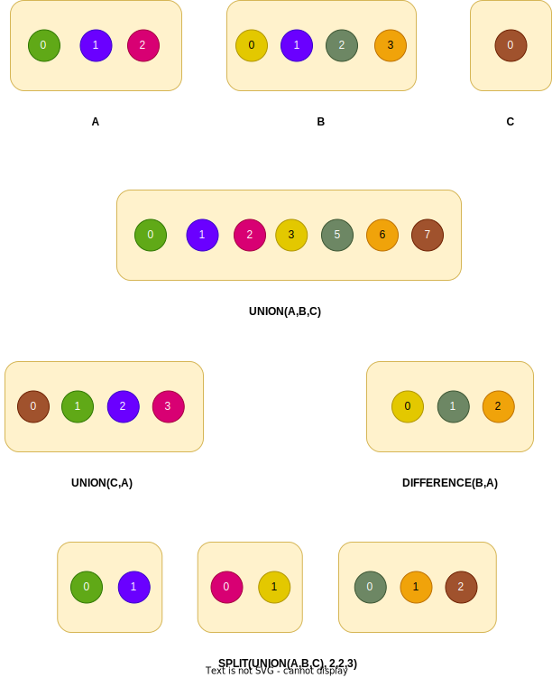

+++
title = "LibPFASST"
+++
# LibPFASST

LibPFASST is a Fortran library that implements multiple Parallel-in-Time algorithms, including the ***P**arallel **F**ull **A**pproximation **S**cheme in **S**pace and **T**ime* (**PFASST**).

LibPFASST is open-source and hosted on [GitHub](https://github.com/libpfasst/LibPFASST).

In the course of this IDP, LibPFASST was extended with an interface that allows it to dynamically grow and shrink by an arbitrary number of processes using the [dynamic Open MPI runtime](@/open-mpi/_index.md).
The source code of this modified version can be found on [GitHub](https://github.com/boi4/libpfasst).
It has the following features and limitations:


<div class="alert alert-success position-static" role="alert">

#### Features:

* Ability to dynamically grow and shrink regular PFASST runs by an arbitrary number of processes. Note that the limitations of the runtime (resize granularity, universe size, ...) apply.
* Ability to dynamically grow and shrink the time dimension in space-parallel PFASST runs ([see showcase](@/showcase/_index.md)).
* New hooks for resize related events. Provides flexibility and extendability to user applications.
* LibPFASST runs (also static ones) do not require anymore that the number of timesteps is a multiple of the size of the main communicator.

</div>


<div class="alert alert-warning position-static" role="alert">

#### Limitations:

* Dynamic resources are only implemented in the core LibPFASST `pf_pfasst_run` routine (other methods like MGRIT were not made dynamic).
* It may be that other methods/features of LibPFASST were affected by changes made in this IDP and stopped working as expected. This is rather unlikely, but no guarantees can be given.
* This version of LibFPASST can only be linked against an MPI library that implements the dynamic Fortran MPI interface as defined at the bottom of [the Open MPI section](@/open-mpi/_index.md). This can be circumvented, by linking with a dummy library that provides routines with the same signatures.
* LibPFASST's interface and options for storing results might not be reliable. It is recommended to use LibPFASST hooks if logging of results is required.
* No resizing heuristics are implemented in LibPFASST itself. The application should add these by setting `pf%dynprocs%resize_delta` in the `PF_PRE_POT_RESIZE` hook.
* We assume that process set operation preserve the order of ranks in the arguments

</div>


## Introduction

LibPFASST is a Fortran implementation of the PFASST algorithm.

It provides some setup routines to the user and entry routines to start the algorithm.
It is written in a generic way and must be extended by the user to make it problem-specific.

To use LibPFASST, a user must:

* Implement a **data encapsulation class** or use one of the pre-defined LibPFASST classes
* Implement a **user level class**. This class defines how different levels in LibPFASST look like and how they interact with each other (interpolate/restrict).
* Implement a **sweeper class**. This class actually defines the specific differential equation that should be solved
* Implement a **main routine** that sets up and calls LibPFASST

Basically all examples in the official LibPFASST repository also implement a **probin module**, which loads general PFASST and problem specific parameters from a `probin.nml` file.

In this version of LibPFASST, the user should additionally add a **resizing routine**, in which the application decides on the current state whether to grow or shrink and add it to the the `PF_PRE_POT_RESIZE` hook. See below ("Controlling dynamic resources") for details.


## Motivation for Dynamic MPI Support


Parallel-in-Time methods such as LibPFASST have some useful properties that make them a good fit for adaptive resources.

These properties include:

* **Orthogonality to space parallelization**: Parallel-in-Time methods can be combined with methods that parallelize in the space dimension ([see showcase](@/showcase/_index.md)).
The space parallelization is usually very loosely coupled to the time parallelization. Because of that, an application where it is difficult to adapt dynamically in space, can simply adapt in the time dimension only.
* **Low inter-block state**: Most of these methods work on a fixed set of time steps which are dependent on the number of processors available. As a consequence, to solve more steps, they split up the total work into little blocks, which are worked on consecutively.
As these blocks are worked on step-by-step, the transition to the next block is a good moment for resource resizing. Furthermore, the next block usually only depends on the solution of the previous block, so no complex data synchronization is needed when new processes arrive.
* **Lack of rebalancing need**: In a space parallel application, the domain is usually partitioned equally among all processors. Once there is a resize, the processors must repartition the space in a smart way and redistribute partial results. This can often become quite complex. In Parallel-in-Time applications however, this is not necessary, as the time domain is a single dimension that is worked on step by step.


These properties are the main motivation to apply dynamic resources to LibPFASST.
This project demonstrates that with these types of libraries, little work is required to add dynamic resources support and that it adds great value to the application.


## Rank Order Preservation Assumption

To avoid complex reordering strategies and being able to reliably create process set grids (as demonstrated in the [showcase](@/showcase/_index.md)), we need process set operations to preserve the relative order of ranks in both the input process sets themselves as well as in the order of the input process sets in the psetop call.
"Rank in a process set" means the rank of a process in groups and communicators derived from the process. Note that we also require them to be consistent in the sense that if you derive two groups from the same process set, the ranks of each process should match.

In general, for most dynamic applications, this type of rank order preservation will be beneficial.
For example, after a `GROW` pset operation, the application can not assume that rank 0 of the newly merged process set belongs to the "old processes".
This is bad, as you would usually try to synchronize data using `MPI_Bcast`, but you would have to come up with a root rank first.
In an ordered setting, we know that rank 0 will remain the same process in both the old and the merged process sets, which makes process coordination much simpler.

In this version of LibPFASST specifically, both `GROW` and `SHRINK` (in the space-parallel case `UNION` and `DIFFERENCE`) are used to resize the LibPFASST run.
Furthermore, we need grid consistency after a resource change (so that processes in the same space pset are working on the same time step). Also, for a lot of coordination , assumptions on the rank of processes are made. For example, when choosing the root rank of a broadcast.

The following is an illustration of how this would look like (`GROW` and `SHRINK` work analogously to `UNION` and `DIFFERENCE`):


<a href="./ordered_psetops.svg" target="_blank">

</a>
<figcaption class="figure-caption" style="text-align: center; margin-bottom: 2em; margin-top: 1em">
    Results of different process set operations with the order preservation assumption. Processes are identified by the color of the circle.
</figcaption>


## Build & Usage Instructions

If you have followed the instructions for the docker build in the [Open MPI section](@/open-mpi/_index.md), LibPFASST was already cloned and compiled at `/opt/hpc/build/LibPFASST`.

Before compiling LibPFASST, make sure that you have installed the dynamic Open MPI fork in one of the ways described in [the Open MPI section](@/open-mpi/_index.md) and `mpicc` and `mpifort` are both in your path.
You can double check by running `mpicc --showme` and `mpifort --showme` and validate that the right include and linking paths are presented.
Furthermore, you will need to have `make` installed.

In general, the compilation instructions for the dynamic version of LibPFASST are the same as for classic LibPFASST:

1. Clone the repository:
```bash
git clone https://github.com/boi4/LibPFASST.git
cd LibPFASST
```

2. When using newer versions of gfortran, add the following line to `Makefile.local` (make sure to use +=):

```bash
FFLAGS_EXTRA += -fallow-argument-mismatch
```


3. Compile LibPFASST:

```bash
make
```

This will create a file in `lib/libpfasst.a` and Fortran module files in `include/`.


#### Basic workflow using dynamic resources

Traditionally, a typical LibPFASST main routine would look like this:

1. create a LibPFASST communicator (of type `pf_comm_t`) from an MPI communicator using `pf_mpi_create`
2. create pfasst structure using `pf_pfasst_create`
3. set up additional LibPFASST things using `pf_pfasst_setup`
4. start PFASST run using `pf_pfasst_run`

This approach can still be used in this version of LibPFASST.
However, if you want to use dynamic resources, you need to setup PFASST a bit differently:

0. find out if the process was started dynamically by calling `pf_dynprocs_check_dynamic`
1. instead of a `pf_comm_t` object, create a `dynprocs_t` object using `pf_dynprocs_create`
2. create pfasst structure using `pf_pfasst_create_dynamic` instead of `pf_dynprocs_create`
3. set up additional LibPFASST things using `pf_pfasst_setup`
4. start PFASST run using `pf_pfasst_run`, additionally passing `join_existing` (set if process is dynamic start) and `premature_exit` (on return will be set to true if pfasst run is not yet finished)

Note that `pf%use_dynprocs` will be set if you use the dynamic setup routines.

To see a more extensive descriptions of these functions, including their arguments, take a look at the API reference at the bottom of this page.

The workflow for "space-parallel mode" is described in the [showcase section](@/showcase/_index.md).


#### When returning from `pf_pfasst_run`

When returning from `pf_pfasst_run` it is important to note the following:

1. previous communication structures (communicators/groups/process sets) might have become invalid
2. the return does not imply that the run is finished. It might be that the process is part of a SHRINK/SUB pset operation
3. if the run is finished, it is unclear which process exactly will hold the final solution

Thus, you should adapt your code to be able to handle these problems:

1. use `pf%comm%comm` and process sets from `pf%dynprocs` to continue communication, if it is required
2. check the value of the `premature_exit` argument to `pf_pfasst_run`. Do not create any communication when it is set and try to stop the process as soon as possible
3. the value of the last step will be at the process that worked on the final time step. Check `pf%state%step`. If is is equal to `nsteps-1`, this is the process with the final solution


#### Controlling dynamic resources

LibPFASST has the ability to grow and shrink the number of parallel-in-time time steps after each block that is worked on.
However, the decision on whether to grow, shrink or keep the number of processes is made by the user.

The user should provide a pfasst hook attached to `PF_PRE_POT_RESIZE`.
This hook is called once on each process right before the application can request resources.

In this hook, the user should set the value of `pf%dynprocs%resize_delta` to the number of time steps LibPFASST should grow or shrink.
When removing resources, it should be set to a negative value.
The value of `pf%dynprocs%resize_delta` is reset to zero after is has been processed. Only the value at the main resource change process (rank 0 of the main_pset or rank 0 of the global pset) matters.

In a normal PFASST run, this the number of processes to be added/removed is equal to the absolute value of `pf%dynprocs%resize_delta`.
In a "space-parallel" setting, the number of processes is equal to the above value times the number of parallel pfasst instances.

For example:

* to shrink LibPFASST by **2** time steps in a normal run, set `pf%dynprocs%resize_delta` to **-2**. A SHRINK pset operation will be made to remove a total of **2** processess
* to grow LibPFASST by **3** time steps in a space-parallel run with **9** parallel LibPFASST instances, set `pf%dynprocs%resize_delta` to **3**. A SHRINK pset operation will be made to remove a total of **27** processess

Note that the number of time steps can never reach 0 or less, the user should double check this.

An example routine for resizing might look like this:

```f08
subroutine resize_decider(pf, level_index)
  type(pf_pfasst_t), intent(inout) :: pf
  integer, intent(in) :: level_index

  integer :: max_timesteps = 8
  integer :: cur_timesteps
  integer :: new_timesteps
  real    :: u

  ! we only set resize_delta at the process that calls the psetop
  if (pf%rank == 0 .and. ((.not. pf%dynprocs%global_used) .or. pf%dynprocs%horizontal_rank == 0)) then
      cur_timesteps = pf%comm%nproc
      ! get random integer between 1 and max_timesteps
      call random_number(u)
      new_timesteps = 1 + floor(u * (max_timesteps + 1 - 1))
      pf%dynprocs%resize_delta = new_timesteps - cur_timesteps
  end if
end subroutine resize_decider
```

This routine sets the `pf%dynprocs%resize_delta` to a value so that the number of time steps are changed to a random number between 2 and `max_timesteps`.
This routine also works in both normal and "space-parallel mode" due to the check on `pf%dynprocs%global_used` in the if-expression.


#### New hooks

The following are additional LibPFASST hooks related to dynamic resources:

<div style="overflow-x:auto;">

| Hook                | Description                                                                                                                |
|---------------------|----------------------------------------------------------------------------------------------------------------------------|
|`PF_PRE_POT_RESIZE`  | Called before asking runtime and checking for resource changes. Useful for controlling resource changes. See above.        |
|`PF_POST_POT_RESIZE` | Called after both asking runtime for resource checks and potentially resizing.                                             |
|`PF_PRE_RESIZE`      | Called before a resize. Only called if there is `mpi_sessions_dyn_v2a_query_psetop` returns a new resizing pset operation. |
|`PF_POST_RESIZE`     | Called after an actual resize.                                                                                             |
|`PF_PRE_SYNC`        | Called right before syncing the state with newly started processes. Useful for syncing additional data.                    |
|`PF_POST_SYNC`       | Called right after syncing the state with newly started processes                                                          |

</div>
<br />

All hooks are called with the level parameter set to 1. It should be ignored by the application.

Please refer to the official LibPFASST documentation for the usage of hooks.


#### Dynamic PFASST Example


The new LibPFASST repository contains [a simple example](https://github.com/boi4/LibPFASST/tree/dynprocs2a/Tutorials/EX6_dynamic_mpi) that is a modified version of the advection-diffusion example with dynamic resizing enabled.
It can be used as a reference for using dynamic LibPFASST.

If you are using the docker setup, the example is available at `/opt/hpc/build/LibPFASST/Tutorials/EX6_dynamic_mpi` and it can be compiled by running `make` in that directory.
To run the script on 8 hosts with 4 processes per host, you can use the following command:

```
mpirun --mca btl_tcp_if_include eth0 -np 8 --host 'n01:4,n02:4,n03:4,n04:4,n05:4,n06:4,n07:4,n08:4' ./main.exe probin.nml
```

To get more verbose output, you can run it like this:

```
mpirun --mca btl_tcp_if_include eth0 -np 8 --host 'n01:4,n02:4,n03:4,n04:4,n05:4,n06:4,n07:4,n08:4' ./main.exe probin.nml debug=.true.
```

The application can figure out the node granularity automatically and will only grow/shrink by a multiple of it (4 in the above commands).


## Implementation Details

The main changes occurred in the following source files:

<div style="overflow-x:auto;">

| File             | Changes                                                                                                 |
|------------------|---------------------------------------------------------------------------------------------------------|
|`pf_dtype.f90`    | Introduction of new `pf_dynprocs_t` types and minor edits to `pf_pfasst_t`                              |
|`pf_dynprocs.f90` | New module containing user-facing routines and internal resize logic                                    |
|`pf_parallel.f90` | Modifications to `pf_pfasst_run` and `pf_block_run` to allow resizing and dynamic starts and shutdowns. |
|`pf_hooks.f90`    | Introduction of new hooks related to application resizing                                               |
<!--|`pf_results.f90`  | Result arrays are have bigger allocation sizes as number of PFASST blocks is unknown a-priori           |-->

</div>
<br />


#### LibPFASST block mode

In LibPFASST, the total number of time steps to compute is split up into blocks.
Each block has the size of the number of time steps that can be worked on parallel in time.
These blocks are being worked on sequentially.

Without dynamic resources, each block will have the same size and from the beginning, the total number of blocks is known.
This assumptions is reflected in multiple places in the original source code.

For this project, the code was modified to remove that assumption, so that the number and size of blocks can change dynamically.
The main loop over the blocks is contained in the `pf_block_run` function (`src/pf_parallel.f90`).
This loop was changed from a `do k = 1,nblocks` loop to a `do while` loop.
Additionally, in the final block, the number of processes might be higher than the number of time steps left.
In this case, only a subset of processes work, and the unused process return.

Finally, to implement dynamic resizing, `pf_dynprocs_resize` is called at the beginning of each new block (except for the first one).


#### The pf_dynprocs_t type

All of the state related to dynamic resources is stored in an `pf_dynprocs_t` object during a dynamic LibPFASST run.

Here is the definition of the `pf_dynprocs_t` type as seen in `src/pf_dtype.f90`:
```f08
!>  Data type for dynamic MPI
type :: pf_dynprocs_t
   integer                       :: resize_delta = 0

   integer                       :: session    ! the mpi session
   ! note that the main MPI communicator derived from main_pset is stored in pf_comm
   character(len=:), allocatable :: main_pset  ! the main process set used

   logical                       :: is_dynamic_start = .false.
   logical                       :: needs_shutdown   = .false.

   ! resource changes
   character(len=:), allocatable :: delta_pset  ! resource change process set
   integer                       :: rc_op       ! the resource change psetop op type


   ! in some cases, multiple pfasst instances run in parallel ("space-parallel mode")
   ! we are both storing a global pset, that contains all processes of other pfasst runs
   ! and a horizontal pset, that contains all processes with the same rank in their resp. main_pset
   ! This can look like this:
   !                         libpfasst psets (=main psets)
   !         ^                 v v v  v
   !         |               +----------+
   !         |            >  | 8 9 10 11|
   !         | horizontal    +----------+
   !         |            >  | 4 5 6  7 |
   !         |      psets    +----------+
   !         |            >  | 0 1 2  3 | < these have rank 0 in libpfasst psets and are the "local leaders"
   !         |               +----------+
   !         |                 ^
   !         |                 this one is both rank 0 in time pset and horizontal/space pset and rank 0 in global comm
   !    time | 
   !
   !    here, there are 4 pfasst instances running in parallel with 3 time parallel steps
   !    the global pset would contain all 12 of these processes
   character(len=:), allocatable :: global_pset
   character(len=:), allocatable :: horizontal_pset

   ! global communicator info (only relevant if global_used)
   logical                       :: global_used = .false. ! whether there are multiple parallel pfasst instances
   integer                       :: global_comm ! the communicator used for global coordination among these instances
   integer                       :: global_rank
   integer                       :: global_size
   integer                       :: horizontal_comm
   integer                       :: horizontal_rank
   integer                       :: horizontal_size
end type pf_dynprocs_t
```

An object of this type is available in the `pf_pfasst_t` type under the `dynprocs` attribute (usually accessed via `pf%dynprocs`).
Additionally, `pf_pfasst_t` contains a flag `is_dynamic` that indicates whether this is a dynamic LibPFASST run and whether `pf%dynprocs` is actually accessible.

The `dynprocs_t` stores up to three process sets together with the respective communicator, rank and size:

1. The `main_pset`. This is the process set where actual PFASST communication takes place. Note that the communicator and other attributes are stored at a different place at `pf%comm%comm`, `pf%rank`, `pf%comm%nproc`.

2. The `global_pset`, when running in "space-parallel mode". This is the process set that spans all active LibPFASST runs. See [showcase](@/showcase/_index.md) for an explanation of "space-parallel mode".

3. The `horizontal_pset`, when running in "space-parallel mode". This is the process set that spans all in processes `global_pset` that have the same rank in their `main_pset` (and thus work on the same time step). This needs to be stored here so LibPFASST is able to shrink.

Additionally, the flags `is_dynamic_start`, `needs_shutdown`, `global_used` indicate whether a process was started dynamically during the LibPFASST run, whether a process needs to shutdown dynamically and whether "space-parallel mode" is enabled, respectively.

`delta_pset` and `op` store the results of `query_psetop` and are used to coordinate once there is an actual resource change pending.

Finally, `resize_delta`, the only variable that the application should set by itself, is used to control the number of timesteps to shrink/grow during the next resize. It is reset to 0 after each resize try (whether sucessful or not).


#### Resizing Routines

The main module for resizing is the `pf_mod_dynprocs` module in `src/pf_dynprocs.f90`.
This module contains routines that can be called by the user, generic helper routines related to process sets/MPI sessions and finally internal routines that should not be called by the user.


<div style="overflow-x:auto;">

| Routine | Type | Description |
|-|-|-|
| `pf_dynprocs_create` | public | constructor for `dynprocs_t` |
| `pf_pfasst_create_dynamic` | public | like `pf_pfasst_create`, but for dynamic runs. Also creates communication with existing run in case of a dynamic start |
| `pf_dynprocs_comm_from_pset` | helper | create a communicator from a process set |
| `pf_dynprocs_pset_contains_me` | helper | check if a process set contains the current process |
| `pf_dynprocs_check_dynamic` | helper | check if this process was started dynamically |
| `pf_dynprocs_create_comm` | internal | create LibPFASST communicator from main process set. Called by `pf_pfasst_create_dynamic` |
| `pf_dynprocs_get_shrink_union` | internal | Use process set operations to create a delta process set to remove from the run |
| `pf_dynprocs_handle_shrink_global` | internal | In a space-parallel run, update main psets on each LibPFASST instance when shrinking  |
| `pf_dynprocs_handle_shrink_grow` | internal | In a space-parallel run, update main psets on each LibPFASST instance when growing  |
| `pf_dynprocs_apply_rc` | internal | Apply a resource change that arrived from the runtime. Update psets and communicators |
| `pf_dynprocs_suggest_rc` | internal | Request a resource change using GROW/SHRINK process set operations. |
| `pf_dynprocs_resize` | internal | Potentially request a resource change, check for a resource change and apply a resource change. |
| `pf_dynprocs_join_run` | internal | Join an existing run. Sync up the state |
| `pf_dynprocs_check_rc` | internal | Check for a pending resource change |
| `pf_dynprocs_check_shutdown` | internal | Check if current process must shut down (part of a shrinking delta process set) |
| `pf_dynprocs_sync_state` | internal | Broadcast current state from rank 0. Called by `pf_dynprocs_apply_rc` and `pf_dynprocs_join_run` |

</div>
<br />


The complete reference for the user-facing routines is available at the bottom of this page.


#### State Syncing

There are two types of states in LibPFASST:

1. **Static state**: This is the type of state that is already determined when LibPFASST is entering the block mode.
For example, static state contains configuration parameters and local variables that are initialized deterministically.
Note that each new process will be spawned with the same command line, and thus with the same configuration options (given that the configuration files did not change on disk).
Static state does not need to be synchronized with new processes.

2. **Dynamic state**: This is the type of state that has been built up dynamically during the execution of the pfasst algorithm.
Dynamic state in LibPFASST includes partial results, progress variables (like the current time step and current time block) and other local variables that depend on the former.


Note that in LibPFASST, almost all of the state is contained within the `pf_pfasst_t` type (usually instantiated as a variable called `pf`).
There exists also a `pf_state_t` type which `pf_pfasst_t` holds an instance of, but it holds both static and dynamic state.
A big amount of state is also contained in the user levels.


**Implementation:**

As we are only considering resource addition at the beginning of a new block, we are only interested in the dynamic state required to join the run at that point.

In this implementation, the only dynamic state that is shared is the following:

* The base time step of the next block (= time step at rank 0)
* The current block number (note that this information is not strictly required for the algorithm, but can be useful for logging)
* The solution of the previous block (= the initial condition for this block)

Implicitly, the size of a block and the step to be worked on are contained in the size of the communicator and the rank of a process in this communicator.

This state sharing is implemented in the `pf_dynprocs_sync_state` routine in the `pf_dynprocs.f90` file using a broadcast from rank 0 over the `pf%comm%comm` communicator (which was derived from the main pset).
The routine assumes that both old and new processes are already merged into a single communicator stored in `pf%comm`.
Furthermore, it assumes that the process of rank 0 is one of the old communicators (see rank order preservation assumption above).


Note that in some rare use cases, state that would be typically categorized as static state like LibPFASST and application parameters
becomes dynamic. For example, when LibPFASST is used in a larger application which needs to solve some problems with dynamic properties.
Another example might be that we cannot ensure that configuration files stay the same on the disk, e.g., when doing runs lasting multiple hours or days.

In these cases more state needs to be synchronized.
To do this, the application must add a synchronization routine to either the `PF_PRE_SYNC` or the `PF_POST_SYNC` hook. <!-- TODO!!!!!!! -->
This hook should behave similarly to the `pf_dynprocs_sync_state` routine in the `pf_dynprocs.f90` file.


<a href="#f90API" class="collapsed" data-bs-toggle="collapse" data-bs-target="#f90API" aria-expanded="false" aria-controls="f90API" style="text-decoration: none; color: black;">
<h3><span class="togglearrow" >▲</span>Dynamic LibPFASST API reference (click to expand)</h3>
</a>


<div id="f90API" class="collapse">

The following routines are part of the `pf_mod_dynprocs` module (`src/pf_dynprocs.f90`).

**Main Routines**

```f90
subroutine pf_dynprocs_create(this, session, main_pset, global_pset, horizontal_pset)
  type(pf_dynprocs_t), intent(out)          :: this
  integer            , intent(in)           :: session
  character(len=*)   , intent(in)           :: main_pset
  character(len=*)   , intent(in), optional :: global_pset
  character(len=*)   , intent(in), optional :: horizontal_pset
end subroutine pf_dynprocs_create
```

Constructs a new `dynprocs_t` object.
The `main_pset` is the process set used for time parallel communication.

When running LibPFASST in "space-parallel mode", both `global_pset` and `horizontal_pset` must be given as well.
`global_pset` is a process set that contains the processes from all parallel LibPFASST runs.
`horizontal_pset` is a process set that contains the processes from all parallel LibPFASST runs that will work on the same time step as the current process.
The different `main_pset` and `horizontal_pset` arguments create a grid on top of `global_pset`. See [the showcase page](@/showcase/_index.md) for a explanation of this.


---

```f90
subroutine pf_dynprocs_destroy(this)
  type(pf_dynprocs_t), intent(out)   :: this
end subroutine pf_dynprocs_destroy
```

Destructs a `dynprocs_t` object. Note that the MPI Session given in the constructor must be finalized by the user.

---

```f90
subroutine pf_pfasst_create_dynamic(pf, dynprocs, nlevels, fname, nocmd)
  type(pf_pfasst_t),   intent(inout)        :: pf
  type(pf_dynprocs_t), intent(in), target   :: dynprocs
  integer,             intent(in), optional :: nlevels
  character(len=*),    intent(in), optional :: fname
  logical,             intent(in), optional :: nocmd
end subroutine pf_pfasst_create_dynamic
```

Create a new `pf_pfasst_t` object in a dynamic LibPFASST setting.
This routine behaves very similar to `pf_pfasst_create`, but takes a `pf_dynprocs_t` argument instead of a `pf_comm_t`.
This routine will point `pf%dynprocs` to the given `dynprocs` argument and will set `pf%is_dynamic`.
Furthermore, this routine established communication from the process sets contained within `dynprocs` and will also establish communication to an existing LibPFASST run if the process was started dynamically.


**Generic Helper Routines**

The following routines are not PFASST specific and are provided as helpers for internal routines, but can also be used by the user for convenience.

```f90
subroutine pf_dynprocs_comm_from_pset(session, pset, comm)
   integer,          intent(in)  :: session
   character(len=*), intent(in)  :: pset
   integer,          intent(out) :: comm
end subroutine pf_dynprocs_comm_from_pset
```

Create an MPI communicator from the given process set.
Combines `MPI_Group_from_session_pset` and `MPI_Comm_create_from_group`.

---

```f90
subroutine pf_dynprocs_pset_contains_me(session, pset, contains_me)
   integer,          intent(in)  :: session
   character(len=*), intent(in)  :: pset
   logical,          intent(out) :: contains_me
end subroutine pf_dynprocs_pset_contains_me
```

Check if the process set `pset` contains the current process.

---

```f90
subroutine pf_dynprocs_check_dynamic(session, is_dynamic)
  integer, intent(in)  :: session
  logical, intent(out) :: is_dynamic
end subroutine pf_dynprocs_check_dynamic
```

Check if the current process was started dynamically as a part of a GROW/ADD/REPLACE process set operation.


---
```f90
subroutine pf_dynprocs_psetop2str(psetop, str)
  integer,          intent(in)  :: psetop
  character(len=*), intent(out) :: str
end subroutine pf_dynprocs_psetop2str
```

Return the name of the given process set operation as a string.


</div>
