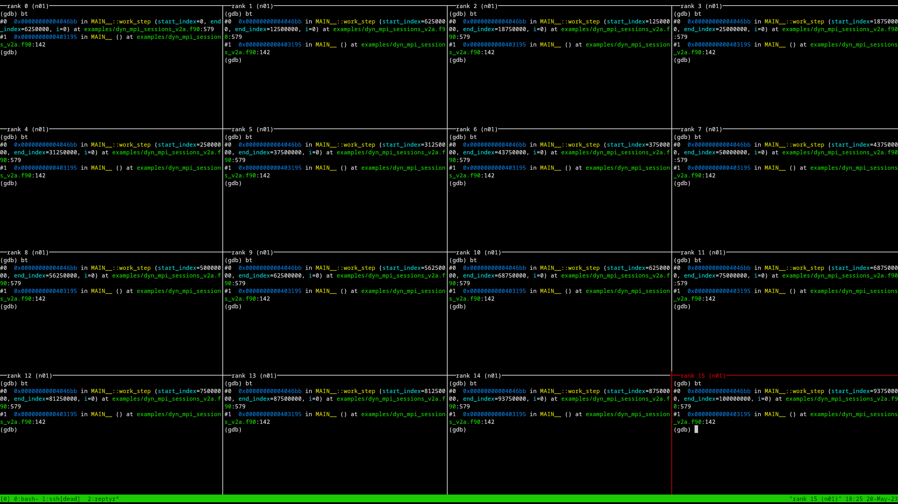
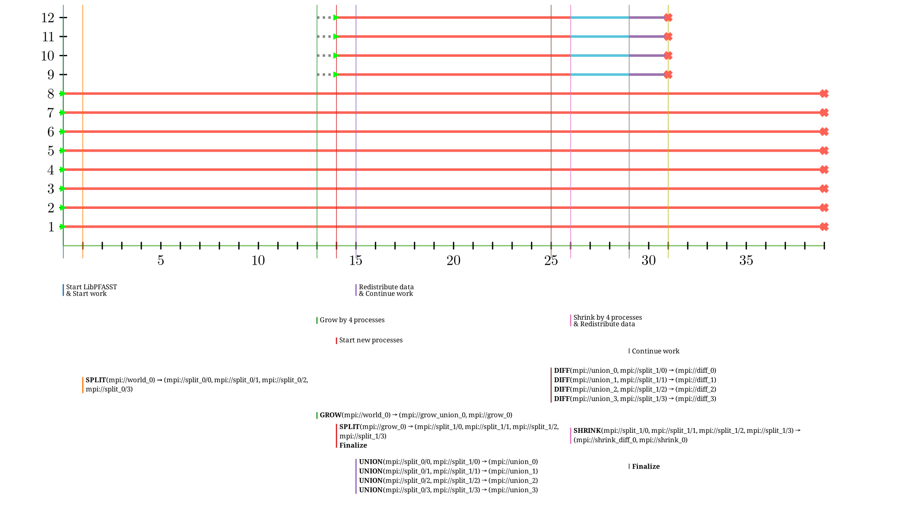

+++
title = "Tools"
+++
# Tools


Debugging parallel programs is hard. Especially MPI programs.

Debugging adaptive programs is even harder. That is why I created multiple tools to facilitate the development and debugging of dynamic applications.

## tmpi.py

`tmpi.py` is a tool that facilitates the development and debugging of adaptive MPI applications.

Its source code is available on Github: [https://github.com/boi4/tmpi-py](https://github.com/boi4/tmpi-py)

It allows you to interact with each process of an MPI run in a different tmux (a terminal multiplexer) pane.
This is very useful in terminal-only environments (ssh/docker/...) where typical tricks like starting multiple instances of a terminal emulator do not work.

It is is a python rewrite of [tmpi](https://github.com/Azrael3000/tmpi) with the following benefits:

* Support for dynamic resizing of MPI jobs
* Faster startup
* Support mpirun with multiple hosts (with `MPIRUNARGS="--host ..." ./tmpi.py ...`)
* mpi rank and host are shown in the upper frame of each pane
* No need to quote + escape mpi command

It has the following disadvantages:

* you can run only one instance of `tmpi.py` on a single host
* if you have mpi processes on other hosts, you need to be able to ssh into them
* `tmpi.py` opens a port for remote mpi processes to register themselves. This might be a security issue.


### Adaptive Applications

When running applications using [dynamic Open MPI](@/open-mpi/_index.md), `tmpi.py` will respond to resource changes in the following fashion:

* **Resource addition**: For each new process, a new tmux pane is created and the stdin/stdout of the process is connected to the pane.
* **Resource removal**: If `TMPI_REMAIN=true`, the panes of stopped processes remain on the screen (useful for post-mortem debugging). Otherwise, the pane will be removed together with the process.

### Dependencies (installed on each MPI host)
- [tmux](https://github.com/tmux/tmux/wiki)
- [Reptyr](https://github.com/nelhage/reptyr)
- Python 3.7 or later

### Further requirements
- If you run mpi processes on remote hosts, you need to be able to ssh into them with the user that started `tmpi.py` without any password prompt

### Installation
Just copy the `tmpi.py` script somewhere in your `PATH`.
If you run MPI on multiple hosts, the `tmpi.py` script must be available at the same location on each host.


### Full usage

`./tmpi.py [number of initial processes] COMMAND ARG1 ...`

You need to pass at least two arguments.
The first argument is the number of processes to use, every argument after that is the commandline to run.

If the environement variable `TMPI_REMAIN=true`, the new window is set to remain on exit and has to be closed manually. ("C-b + &" by default)

You can pass additional 'mpirun' argument via the `MPIRUNARGS`` environment variable

You can use the environment variable `TMPI_TMUX_OPTIONS` to pass options to the `tmux` invocation,
  such as `TMPI_TMUX_OPTIONS='-f ~/.tmux.conf.tmpi'` to use a special tmux configuration for tmpi.

Little usage hint: By default the panes in the window are synchronized. If you wish to work only with one process without distraction, maximize the corresponding pane pane ("C-b + z" by default). Return to the global view using the same shortcut.


### Examples

Parallel debugging with GDB:
```
tmpi.py 4 gdb executable
```

It is advisable to run gdb with a script (e.g. `script.gdb`) so you can use
```
tmpi.py 4 gdb -x script.gdb executable
```

If you have a lot of processors you want to have `set pagination off` and add the `-q` argument to gdb:
```
tmpi.py 4 gdb -q -x script.gdb executable
```
This avoids pagination and the output of the copyright of gdb, which can be a nuissance when you have very small tmux panes.

A more complicated `tmpi.py` command might look like this:

```bash
MPIRUNARGS='--mca btl_tcp_if_include eth0 --host n01:4,n02:4,n03:4,n04:4,n05:4,n06:4,n07:4,n08:4' \
    TMPI_REMAIN="true" \
        tmpi.py 32 \
        gdb -q \
                -ex "set pagination off" \
                -ex "set breakpoint pending on" \
                -ex "b _gfortran_runtime_error_at" \
                -ex "b ompi_errhandler_invoke" \
                -ex "b myfile.f90:1337" \
                -ex r \
                -ex q \
                --args \
                ./executable arg1 arg2 ...
```

Here, `tmpi.py` will run 32 MPI processes on 8 hosts in parallel with GDB attached to each of them. Also, GDB will break on Fortran and Open MPI errors and on a custom user breakpoint.
Note that the `-ex` commands could also be put into a script file.


### Keybindings

In general, the keybindings from [tmux](https://github.com/tmux/tmux/wiki) apply. The most useful ones are the following:

* `Ctrl-b + c` - Create a new window
* `Ctrl-b + n` - Go to next window
* `Ctrl-b + p` - Go to previous window
* `Ctrl-b + &` - Kill current window (a window is like a "tab" at the bottom)
* `Ctrl-b + z` - Maximize/Minimize currently selected pane. Useful for debugging a single process.
* `Ctrl-b + <arrow key>` - Select pane left/right/above/below currently selected pane.


### Screenshots


<br/>
<a href="./tmpi_debug_example.png" target="_blank">

</a>
<figcaption class="figure-caption" style="text-align: center; margin-bottom: 2em; margin-top: 1em">
    tmpi.py showing 16 gdb processes debugging a single MPI application.
</figcaption>

<div class="embed-responsive embed-responsive-16by9">
    <video class="embed-responsive" controls width="100%">
        <source src="./tmpi_add_sub_example.mp4" type="video/mp4">
        Video Placeholder
    </video>
</div>
<figcaption class="figure-caption" style="text-align: center; margin-bottom: 2em; margin-top: 1em">
    tmpi.py running an application that grows and shrinks dynamically on up to 4 hosts.
</figcaption>

---


<br/>

## DynVis

<br/>

It can be useful to visualize a dynamic MPI run, to be able to retrospectively figure out which Process Set events happened.
It is usually quite difficult to figure this out own your own just by looking at print statements in the terminal (although `tmpi.py` already drastically improves this situation).

Therefore, I have decided to design a log file format and write an accompanying log file visualizer called `DynVis`.
The source code of it is available on [GitHub](https://github.com/boi4/dynprocs_visualize).


### Logging format (v1)

<div class="alert alert-warning position-static" role="alert">
  Warning: This log file is a specification only. As of May 2023, the dynamic Open MPI fork does no actual logging.
</div>

A log file of an MPI run is a CSV file containing lines in the following format:

`unixtimestampmilis (integer), #job id (integer), action (string), [Json with extra data, escaped with double quotes] (string)`

Where `unixtimestampmilis` is the number of miliseconds since [epoch](https://en.wikipedia.org/wiki/Epoch_(computing)),
`job_id` is a unique identifier for the MPI job that was started and
`action` is one of the unique actions below and the json provides some more information to the action.

Additionally, we allow for blank lines, and lines starting with a pound sign (`#`), which are both ignored while parsing.

Available actions:

|**Action**         | **Description**                                                                               | **Example JSON**                                                                                                                                 |
|-------------------|-----------------------------------------------------------------------------------------------|------------------------------------------------------------------------------------------------------------------------------------------------- |
|job_start          | A new job is started.                                                                         | `"{""job_id""        : 0}"`                                                                                                                      |
|job_end            | A job has finished.                                                                           | `"{""job_id""        : 0}"`                                                                                                                      |
|new_pset           | A new process set is announced. Needs to be done before any other interaction with that pset. | `"{""proc_ids""      : [0,1,2,3,4,5,6,7], ""id"": ""mpi://world_0""}"`                                                                           |
|set_start          | A new process set is started for these processes (initial start or an add/grow).              | `"{""set_id""        : ""mpi                    ://world_0""}"`                                                                                  |
|process_start      | A new process has started.                                                                    | `"{""proc_id""       : 0}"`                                                                                                                      |
|process_shutdown   | A process has shutdown.                                                                       | `"{""proc_id""       : 0}"`                                                                                                                      |
|psetop             | A process set operation has been applied by the runtime.                                      | `"{""initialized_by"": 0, ""set_id""            : ""mpi://world_0"", ""op"": ""grow"", ""input_sets"": [], ""output_sets"": [""mpi://grow_0""]}"`|
|finalize_psetop    | The application has successfully called finalize_psetop.                                      | `"{""initialized_by"": 0, ""set_id""            : ""mpi://world_0""}"`                                                                           |
|application_message| Some message from the application.                                                            | `"{""message""       : ""LibPFASST started""}"`                                                                                                  |
|application_custom | Some custom data from the application.                                                        | *arbitrary, but valid JSON*                                                                                                                                      |

<br/>

**Rationale:** This format can be easily parsed by most programs like Excel, Python-Pandas, etc. as it is a CSV format.
CSV also allows simple merging (by concatenation) of log files and also allows the logger to log action by action compared to a more complex format like YAML or JSON.
Allowing blank lines allow to add some visual separation of phases of the application and comments allow to manually add more context to specific events.

Furthermore, here are some basic rules for the contents of a log files:

* log entries do not need to be sorted by time (you can just cat together log files from different sources without any sorting). However, if two events have the exact same timestamp given, their order in the log file matters.
* the file can include empty lines and lines beginning with a pound (#) sign, which are both skipped
* each process set has a unique name (no double “mpi://WORLDs”) and a determined number of procs. The name should be globally unique, but similar to the names that the applications see.
* each processor is identified by an integer in {0-(N-1)}
* each process must be part of at least one process set the moment it is used
* before a process set is used, `new_pset` must be called beforehand (timewise)
* `set_start` comes before (timewise) the start of the processes in the set


The following code snippet can be used to read the log file (`log_file_path`) in Python Pandas:
```python
import pandas as pd
import json

# define columns
columns = ['unixtimestamp', 'job_id', 'event', 'event_data']

# read csv file, ignore comments
df = pd.read_csv(log_file_path, names=columns, comment='#')

# remove empty and invalid lines
df.dropna(how="all", inplace=True)

# parse json
df['event_data'] = self.df['event_data'].apply(json.loads)
```

An example log file can be found [here](https://github.com/boi4/dynprocs_visualize/blob/main/examples/libpfasst_run_parallel.csv).
A useful class for parsing these logfiles can be found [here](https://github.com/boi4/dynprocs_visualize/blob/main/timeline.py).


### Requirements

The visualization is based on [Manim](https://docs.manim.community/en/stable/installation.html), a visualization library for mathematical concepts.

Make sure to follow the [installation instrucions](https://docs.manim.community/en/stable/installation.html) to install Manim on your operating system.

### Usage

Clone the DynVis repo:

```bash
git clone https://github.com/boi4/dynprocs_visualize.git && cd dynprocs_visualize
```

Run the `dynvis.py` script with the path to the log file:

```bash
python3 ./dynvis.py path/to/log/file
```

This will create an rendered video in `media/videos/480p15/VisualizeDynProcs.mp4`.

There exist some command line flags to tweak the behavior of DynVis:

```
usage: dynvis.py [-h] [--quality {low_quality,medium_quality,high_quality}] [--preview] [--round-to ROUND_TO] logfile

positional arguments:
  logfile

options:
  -h, --help            show this help message and exit
  --quality {low_quality,medium_quality,high_quality}, -q {low_quality,medium_quality,high_quality}
  --preview, -p
  --round-to ROUND_TO, -r ROUND_TO
                        On how many 10^r miliseconds to round the time to when aligning events
  --save_last_frame, -s
                        Save as last frame as a picture
```


### Example Output

<br/>

<div class="embed-responsive embed-responsive-16by9">
    <video class="embed-responsive" controls width="100%">
        <source src="./VisualizeDynProcs.mp4" type="video/mp4">
        Video Placeholder
    </video>
</div>
<figcaption class="figure-caption" style="text-align: center; margin-bottom: 2em; margin-top: 1em">
    Animated visualization of the <a href="https://github.com/boi4/dynprocs_visualize/blob/main/examples/libpfasst_run_parallel.csv">example log file</a>.
</figcaption>


<a href="./VisualizeDynProcs.png" target="_blank">

</a>
<figcaption class="figure-caption" style="text-align: center; margin-bottom: 2em; margin-top: 1em">
    Final frame of the visualization
</figcaption>
